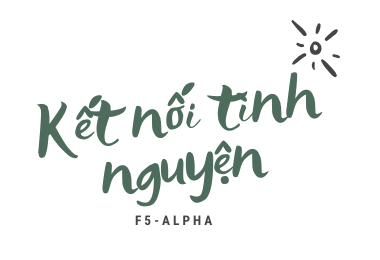
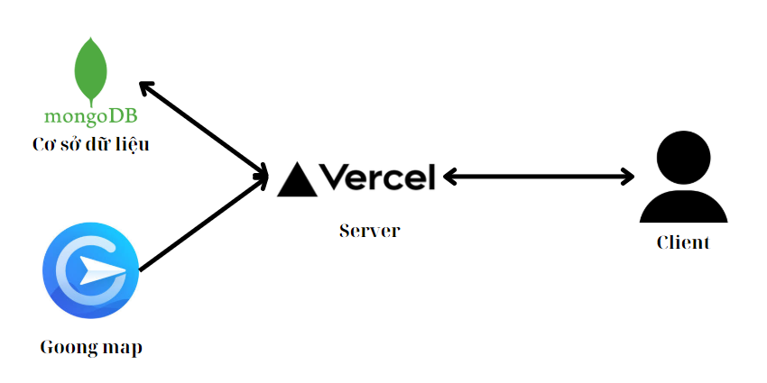
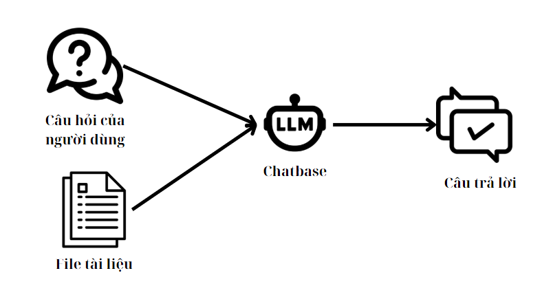
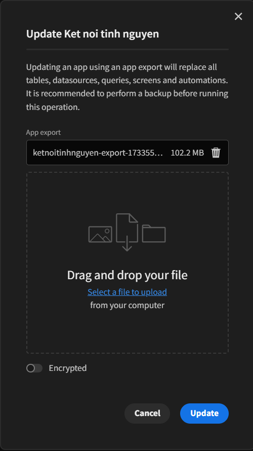

<p align="center">
    
</p>

<p align="center">
  <a href="https://github.com/NHD04072004/ketnoitinhnguyen/blob/master/LICENSE"></a>
  <a href="https://github.com/NHD04072004/ketnoitinhnguyen/issues"></a>
  <a href="https://github.com/NHD04072004/ketnoitinhnguyen/pulls"></a>
  <a href="https://github.com/NHD04072004/ketnoitinhnguyen/graphs/contributors"></a>
</p>


<a href="https://github.com/NHD04072004/ketnoitinhnguyen/issues/new?assignees=&labels=&projects=&template=bug_report.md&title=%F0%9F%90%9B+Bug+Report%3A+">Bug Report ⚠️
</a><br>
<a href="https://github.com/NHD04072004/ketnoitinhnguyen/issues/new?assignees=&labels=&projects=&template=feature_request.md&title=RequestFeature:">Request Feature 👩‍💻</a>

# Kết nối tình nguyện [](https://nhd04072004.github.io/ketnoitinhnguyen/)

Ứng dụng giúp kết nối giữa nhân dân với tình nguyện viên và các nhà hảo tâm. Mục tiêu của dự án là phát triển một hệ thống dựa trên `nền tảng LCDP` để kết nối các các tình nguyện viên với các tổ chức chính quyền địa phường, các tổ chức muốn tham gia hỗ trợ tái thiết sau bão lũ, phục hồi cuộc sống. Quản lý các yêu cầu hỗ trợ từ phía người dân và quản lý các tình nguyện viên và tổ chức giúp họ kết nối với nhau dễ dàng.

Dự án được thực hiện trong cuộc thi [Phần Mềm Nguồn Mở Olympic Tin học Sinh viên Việt Nam 2024](https://www.olp.vn/procon-pmmn/ph%E1%BA%A7n-m%E1%BB%81m-ngu%E1%BB%93n-m%E1%BB%9F). Được cấp phép nguồn mở theo giấy phép [Apache-2.0](https://www.apache.org/licenses/LICENSE-2.0) bởi đội F5-alpha.

Để biết thêm chi tiết về cuộc thi, xem tại [đây](https://vfossa.vn/tin-tuc/cong-bo-de-thi-noi-dung-phan-mem-nguon-mo-olympic-tin-hoc-sinh-vien-viet-nam-2024-727.html).


## 🔎 Danh Mục

1. [Giới Thiệu](#giới-thiệu)
    - [📝 Các chức năng chính](#các-chức-năng-chính)
    - [️🎯 Mục tiêu](#-mục-tiêu)
    - [📂 Chi tiết chức năng](#-chi-tiết-chức-năng)
    - [📝 Các đặc điểm nổi bật và lợi ích cho người dùng](#-các-đặc-điểm-nổi-bật-và-lợi-ích-cho-người-dùng)
    - [️🎯 Mục tiêu tương lai của hệ thống](#-mục-tiêu-tương-lai-của-hệ-thống)
    - [🙋 Đối tượng hướng đến](#đối-tượng-hướng-đến)
2. [Tổng Quan Hệ Thống](#👩‍💻-tổng-quan-hệ-thống)
    - [Plugins](#plugins)
    - [Services](#services)
    - [Cơ sở dữ liệu](#cơ-sở-dữ-liệu)
3. [⚙ Cấu Trúc Thư Mục](#cấu-trúc-thư-mục)
4. [Truy cập hệ thống](#️-truy-cập-hệ-thống)
    - [💻 Demo Online](#demo-online)
    - [🙋 Các đối tượng trong hệ thống](#các-đối-tượng-trong-hệ-thống)
5. [Hướng Dẫn Cài Đặt](#hướng-dẫn-cài-đặt)
    - [📋 Yêu Cầu - Prerequisites](#yêu-cầu-📋)
    - [🔨 Cài Đặt](#🔨-cài-đặt)
6. [🙌 Đóng Góp](#🙌-đóng-góp-cho-dự-án)
7. [📝 License](#📝-license)

## Giới Thiệu

- Những năm gần đây chúng ta cũng đã phải trải qua một số thời điểm phải ứng phó khẩn cấp trên quy mô rộng như thời kì đại dịch Covid, thiên tai do bão lũ gây ra hàng năm.
- Trong năm 2024 này đã có đợt [bão Yagi](https://vi.wikipedia.org/wiki/B%C3%A3o_Yagi_(2024)) là xoáy thuận nhiệt đới thứ 11 của Mùa bão Tây Bắc Thái Bình Dương 2024. Cơn bão đã ảnh hưởng tới một loạt các nước châu Á đặc biệt là Philippines, Trung Quốc và Việt Nam. Hàng loạt khu vực bị tàn phá nghiêm trọng, đặt ra những thách thức lớn trong công tác cứu trợ, phục hồi và khắc phục hậu quả sau bão.
- Tại những thời điểm này thường xuất hiện các nhu cầu ứng dụng CNTT để kết nối cộng đồng, cung cấp thông tin nhanh phục vụ các hoạt động ứng phó khẩn cấp, khắc phục hậu quả, hỗ trợ nhân đạo sau thảm họa.
- Trong bối cảnh đó, ứng dụng `Kết nối tình nguyện` ra đời như một giải pháp công nghệ thiết yếu nhằm:
  - Kết nối cộng đồng tình nguyện viên: Tập hợp những cá nhân và tổ chức sẵn sàng đóng góp nguồn lực, thời gian và kỹ năng để hỗ trợ cộng đồng.
  - Cung cấp thông tin nhanh và chính xác: Đảm bảo thông tin về các khu vực bị ảnh hưởng, nhu cầu cứu trợ, và tình hình khẩn cấp được chia sẻ đến các tổ chức tham gia cứu trợ.
  - Hỗ trợ điều phối hiệu quả: Sử dụng công nghệ để tối ưu hóa việc phân bổ nguồn lực hợp lý và nhanh chóng.
### Các chức năng chính

Project tập trung vào các chức năng chính như sau:

- 📝 Đăng ký tham gia tình nguyện viên.
- 📝 Đăng ký thành lập tổ chức tình nguyện.
- 💬 Người dân gửi yêu cầu hỗ trợ.
- 🗾 Bản đồ hỗ trợ.
- 🗨️ Chatbot tra cứu thông tin của các cơ quan thường trực.
- 🫶 Quản lý và phân phối nguồn lực cứu trợ.
### 🎯 Mục tiêu

- **Kết nối cộng đồng tình nguyện nhanh chóng**: Cung cấp nền tảng để tình nguyện viên từ mọi miền có thể liên lạc, đăng ký và tham gia hỗ trợ trong thời gian ngắn, đảm bảo hỗ trợ khắc phục hậu quả sau bão lũ.
- **Ứng dụng công nghệ bản đồ**: Sử dụng bản đồ trực tuyến để giúp tổ chức tình nguyện xác định các địa điểm cần hỗ, từ đó phân phối tình nguyện viên và tài nguyên cứu trợ(thực phẩm, thuốc, nước sạch,...) một cách hiểu quả và nhanh chóng. Ngoài ra bản đồ còn giúp quản trị quản lý được và xem xét các điểm hỗ trợ.
- **Hỗ trợ điều phối nguồn lực**: Phân bổ tình nguyện viên và các tổ chức đến đúng nơi cần thiết, tránh lãng phí hoặc thiếu hụt nguồn lực hỗ trợ.
- **Ứng dụng Chatbot hỗ trợ tư vấn**: Sử dụng chatbot hỗ trợ các tổ chức tình nguyện tìm kiếm thông tin liên hệ đến các địa phương để tham gia hỗ trợ.
- **Tăng cường khả năng sẵn sàng ứng phó**: Xây dựng mạng lưới tình nguyện viên và các quy trình vận hành tiêu chuẩn giúp cộng đồng luôn trong trạng thái sẵn sàng đối phó với các thảm họa tiềm tàng. 
- **Gắn kết lâu dài và phát triển bền vững**: Cung cấp nền tảng không chỉ tập trung và các hoạt động ngắn hạn mà còn hướng tại hỗ trợ khắc phục hậu quả sau thiên tai, bão lũ lâu dài.

### 🔍 Chi tiết chức năng

#### 🌪 Yêu cầu hỗ trợ

- Người dùng gửi yêu cầu cứu trợ
- Theo dõi tình trạng yêu cầu cứu trợ
#### 🙋 Tình nguyện viên

- Đăng ký tham gia tình nguyện viên
- Theo dõi tình trạng đăng ký tình nguyện
- Theo dõi thông tin tổ chức sẽ hoạt động
- Quản lý thông tin đăng ký
#### 👬 Tổ chức tình nguyện

- Theo dõi tình trạng đăng ký tổ chức
- Theo dõi thông tin tổ chức
- Theo dõi thông tin tình nguyện viên tham gia
- Theo dõi nhiệm vụ hỗ trợ được giao
#### 🤝 Kết nối cộng đồng

- Kết nối nhu cầu tình nguyện
- Nền tảng tình nguyện viên
- Hệ thống điều phối, phân chia các yêu cầu cứu trợ
#### 🏃 Xây dựng hệ thống hỗ trợ hiệu quả

- Quản lý yêu cầu hỗ trợ 
- Quản lý tình nguyện và tổ chức tình nguyện
- Phân bổ tình nguyện viên cho tổ chức chính xác
- Phân bổ các yêu cầu cho tổ chức tình nguyện
#### 🌳 Đóng góp cộng đồng

- Hỗ trợ xây dựng cộng đồng tình nguyện
- Nâng cao năng lực khắc phục hậu quả của cộng đồng
- Kết nối cộng động tình nguyện nhanh chóng
- Tối ưu hóa việc sử dụng nguồn lực địa phương
- Nâng cao ý thức phòng chống thiên tai trong cộng đồng
- Phát triển các phương pháp cứu trợ hiệu quả và bền vững
#### 🧠  Tích hợp công nghệ

- Hệ thống quản lý và tư vấn thông tin
- Dẫn đường và chỉ dẫn


### 📌 Các đặc điểm nổi bật và lợi ích cho người dùng

- **Người dân yêu cầu hỗ trợ dễ dang**: Hệ thống giúp người dân gửi được các yêu cầu hỗ trợ từ xa, nhanh chóng và dễ dàng. Tổ chức có thể tiếp cân được các yêu cầu của người dân dễ dàng.
- **Kết nối tức thời**: Ứng dụng cho phép tình nguyện viên dễ dàng đăng ký, tham gia và kết nối với tổ chức tình nguyện.
- **Đối với các tổ chức tình nguyện**: Có thể kết nối được với các tình nguyện viên ở địa điểm hỗ trợ dễ dàng và xác định được các điểm đang cần hỗ trợ.

*`Kết nối tình nguyện`* không chỉ là một ứng dụng kết nối tình nguyện viên tạm thời mà còn là một lời kêu gọi, kết nối mọi người lại với nhau cùng nhan chung sức khắc phục hậu quả do thiên tai, bão lũ để lại. Tạo thành một cộng đồng vững mạnh luôn sẵn sẵng hành động.

### 🌏 Mục tiêu tương lai của hệ thống

-**Mở rộng mạng lưới tình nguyện viên và tổ chức**: Tăng số lượng tình nguyện viên và các tổ chức tham gia và hoạt động cứu trợ, tạo thành một cộng đồng tình nguyện vững mạnh.
-**Nâng cao trải nghiệm người dùng**: Phát triển giao diện trực quan và thân thiện hơn, hỗ trợ nhiều ngôn ngữ để dễ dàng sử dụng ở các vùng miền khác nhau.
-**Tạo nền tảng cộng đồng tương tác**: Thêm các tính năng chat trong các tổ chức để các thành viên có thể liên lạc và tương tác với nhau dễ dàng hơn.

### 🎯Đối tượng hướng đến

-**Người dân cần hỗ trợ**: Những cá nhân hoặc gia đình chịu ảnh hưởng bởi thiên tai cần gửi yêu cầu hỗ trợ khẩn cấp về nhu yếu phẩm, y tế...Ứng dụng giúp họ dễ dàng gửi thông tin yêu cầu và nhận được sự hỗ trợ nhanh chóng.
-**Tình nguyện viên**: Những người có mong muốn tham gia hỗ trợ cộng đồng, từ học sinh, sinh viên, người lao động đến các chuyên gia trong các lĩnh vực như y tế, cứu hộ, và giáo dục.(đủ điều kiện tham gia cứu trợ).
-**Tổ chức tình nguyện**: Các tổ chức đã hoạt động trong lĩnh vực hỗ trợ ứng phó thiên tai hoặc đang có ý định tham gia hỗ trợ nhưng chưa kết nối được các tình nguyện viên. Ứng dụng giúp tổ chức kết nối các tình nguyện, quản lý yêu cầu hỗ trợ và theo dõi thông tin.
-**Chính quyền địa phương và cơ quan chức năng**: Các đơn vị hành chính địa phương chịu trách nhiệm trong việc ứng phó và khắc phục hậu quả thiên tai, thảm họa và xử lý các yêu cầu khẩn cấp cần xử lý ngay.

## 👩‍💻 Tổng Quan Hệ Thống

Hệ thống được xây dựng bằng công nghệ LCDP (Low code development platform), cụ thể là [Budibase](https://budibase.com/)

### Plugins

- [bb-qr-code](https://github.com/rosnerdev/bb-qr-code): tạo qr cho tình nguyện viên vào nhóm trò chuyện.
- [Geolocation](https://github.com/andz-bb/budibase-component-geolocation): lấy vị trí người dùng.

### Services

- [Goongmap admin server](./goong-map-admin-home/README.md): hiển thị bản đồ, chỉ đường và đánh dấu các yêu cầu hỗ trợ.
- [Goongmap admin home](./goong-map-admin-home/README.md) Giao diện hiển thị bản đồ chỉ đường dành cho admin.
- [Goongmap organization](./goong-map-org-oke/README.md) Giao diện hiển thị bản đồ danh cho tổ chức

<p align="center">
    
</p>

- [Chatbase](https://www.chatbase.co/): tra cứu các thông tin của các cơ quan thường trực của các tỉnh/quận/huyện.

<p align="center">
    
</p>

### Cơ sở dữ liệu

- [BudibaseDB](https://docs.budibase.com/docs/budibasedb): Lưu các thông tin của dự án.
- [MongoDB](https://www.mongodb.com/): Lưu trữ thông tin người dân gửi yêu cầu hỗ trợ.

## Cấu trúc thư mục

```
.
├── .github/
├── docs/
│   ├── docs/
│   ├── images/
│   ├── .gitignore
│   └── mkdocs.yaml
├── goong-map-admin-home/
├── goong-map-admin/
├── goong-map-org/
├── .gitignore
├── LICENSE
└── README.md
```
## 🖥️ Truy cập hệ thống

### Demo Online

Bạn có thể trải nghiệm Kết nối tình nguyện tại: https://anhquan.budibase.app/app/ketnoitinhnguyen#/loginvolunteer

### Các đối tượng trong hệ thống

- 👥 **Người Dùng**:
  - Dành cho người dân cần gửi yêu cầu hỗ trợ
  - Theo dõi tình trạng yêu cầu
- 👥 **Tình nguyện viên**:
  - Dành cho tình nguyện viên
  - Đăng ký tình nguyện viên
  - Quản lý tài khoản 
  - Theo dõi thông tin các nhân và tổ chức hoạt động
- 👥 **Tổ chức**:
  - Dành cho tổ chức
  - Quản lý thông tin tổ chức
  - Quản lý nhiệm vụ cứu trợ
  - Quản lý tình nguyện viên tham gia tổ chức
- ⚙️ **Admin**:
  - Dành cho quản trị viên hệ thống
  - Quản lý người dùng
  - Phân bổ tình nguyện viên và tổ chức
  - Xác nhận các yêu cầu hỗ trợ
  - Theo dõi bản đồ hỗ trợ

## Hướng Dẫn Cài Đặt

### Yêu Cầu 📋

Để cài đặt và chạy được dự án, trước tiên bạn cần phải cài đặt các công cụ bên dưới. Hãy thực hiện theo các hướng dẫn cài đặt sau, lưu ý chọn hệ điều hành phù hợp với máy tính:

-   [Docker-Installation](https://docs.docker.com/get-docker/)
-   [Docker-Compose-Installation](https://docs.docker.com/compose/install/)
-   [NodeJS v22-Installation](https://nodejs.org/en/download/)
-   [Budibase Cli-Installation](https://docs.budibase.com/docs/budibase-cli-setup)

**Cài đặt nhanh:** File `setup.sh` trong dự án của tôi
```bash
sh setup.sh
```

### 🔨 Cài Đặt

Trước hết, hãy khởi tạo dự án:

```bash
mkdir myProject
cd myProject

budi hosting --init
```

Tiếp theo, khởi chạy dự án:

```bash
budi hosting --start
```

Chạy dự án trên trình duyệt của bạn [http://localhost:10000](http://localhost:10000). Sau đó tạo đăng nhập và tạo ứng dụng.

Tải dự án về tại [link](https://github.com/NHD04072004/ketnoitinhnguyen/releases/download/v2.0/ketnoitinhnguyen-export-1733737522961.tar.gz).

Sau đó, vào `Settings > Export/Import > Import app` rồi kéo thả file tài nguyên vào, sau đó ấn `Update`.

<p align="center">
    
</p>

## 🙌 Đóng góp cho dự án

Bạn muốn đóng góp cho dự án, hãy đọc [CONTRIBUTING](.github/CONTRIBUTING.md) để biết thêm chi tiết.

## Liên hệ

Nếu bạn có câu hỏi, đừng ngần ngại liên hệ với chúng tôi

- Nguyễn Hải Đăng: 22a1001d0049@students.hou.edu.vn
- Nguyễn Thế Lộc: 22a1001d0199@students.hou.edu.vn
- Trần Anh Quân: 22a1001d0275@students.hou.edu.vn

## 📝 License

This project is licensed under the terms of the [Apache-2.0](LICENSE) license.
